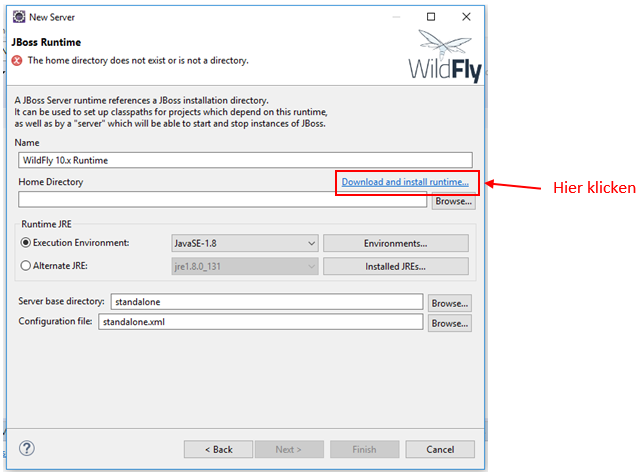

	   _____  .__                                             .__              
	  /     \ |__| ___________  ____  ______ ______________  _|__| ____  ____  
	 /  \ /  \|  |/ ___\_  __ \/  _ \/  ___// __ \_  __ \  \/ /  |/ ___\/ __ \  
	/    Y    \  \  \___|  | \(  <_> )___ \\  ___/|  | \/\   /|  \  \__\  ___/   
	\____|__  /__|\___  >__|   \____/____  >\___  >__|    \_/ |__|\___  >___  >  
	        \/        \/                 \/     \/                    \/    \/   
         __________                     .__                          __    
         \______   \ ____   ____   ____ |  |__   _____ _____ _______|  | __
          |    |  _// __ \ /    \_/ ___\|  |  \ /     \\__  \\_  __ \  |/ /
          |    |   \  ___/|   |  \  \___|   Y  \  Y Y  \/ __ \|  | \/    < 
          |______  /\___  >___|  /\___  >___|  /__|_|  (____  /__|  |__|_ \
                 \/     \/     \/     \/     \/      \/     \/           \/
        
Version 0.25  
  
Anleitung zur Inbetriebnahme des Microservice-Benchmarks  
========================================================

##1 Vorbereitung

Am einfachsten ist es, eine virtuelle Maschine mit Windows für die Testumgebung aufzusetzen. Ich beschreibe nachfolgend alle Schritte, die zur Installation und Inbetriebnahme erforderlich sind. Triviale Schritte, wie auf „Weiter“ klicken, habe ich aus Längegründen weggelassen. Es wird allerdings stets im Text erwähnt, wenn Schritte weggelassen wurden und einfach mit „Weiter“ durchgeklickt werden soll. Da sich das Projekt noch in der Anfangsphase befindet, wollte ich anmerken, dass noch ein paar Bugs im Code sind. Die folgenden Kapitel erklären das Installieren der Umgebung und die Inbetriebnahme. 

###1.1 Download der Software

Benötigt werden [Java SE Development Kit 8]( http://www.oracle.com/technetwork/java/javase/downloads/jdk8-downloads-2133151.html "Java SE Development Kit 8"),
[Eclipse]( https://www.eclipse.org/downloads/download.php?file=/oomph/epp/neon/R3/eclipse-inst-win64.exe "Eclipse"),
[Wildfly 10.1.0.Final]( http://wildfly.org/downloads/ "Wildfly 10.1.0.Final"),
[PostgesSQL 9.6.3]( https://www.enterprisedb.com/downloads/postgres-postgresql-downloads#windows "PostgesSQL 9.6.3")

##2	Programme installieren

###2.1	Java SE Development Kit 8 installieren

Zuerst muss das JDK installiert werden. Dazu die Datei jdk-8u131-windows-x64.exe ausführen und der Installationsroutine mit Standardeinstellungen bis zum Ende folgen. 

###2.2	Eclipse installieren

Nachdem das JDK installiert wurde, kann Eclipse installiert werden. Dazu die Datei eclipse-inst-win64.exe ausführen und Eclipse IDE for Java EE Developers installieren (Abb. 1). Anschließend der Installationsroutine bis zum Ende folgen.

  
Abbildung 1: Installation Eclipse

###2.2.1	Wildfly in Eclipse einbinden
Zunächst müssen die JBoss Tools installiert werden. Dazu in Eclipse auf Help -> Eclipse Marketplace gehen, dann JBoss Tools in das Suchfeld eingeben und mit Enter bestätigen (Abb. 2). Bis zu JBoss Tools herunterscrollen und dort auf „Install“ klicken. Falls eine Meldung kommt, dass die Installation nicht wie angefordert ausgeführt werden kann, klicken Sie auf „Update my installation to be compatible with the items being installed“ (Abb.3). Der Installationsroutine bis zum Ende folgen. 
**Achtung:** Sollten hier Probleme bei der Installation auftreten, können die JBoss Tools alternativ über Help -> Install new Software installiert werden. Dort auf „Add...“ klicken und als Name JBoss und unter Location  http://download.jboss.org/jbosstools/neon/stable/updates/ eingeben, bestätigen und auswählen wie in Abbildung 4 dargestellt.

  
Abbildung 2: JBoss installieren

  
Abbildung 3: JBoss installieren 2

  
Abbildung 4: JBoss installieren Alternative

Nachdem die JBoss Tools installiert wurden, muss ein Wildfly-Server eingerichtet werden. Dazu im unteren Bereich auf den Reiter „Server“ klicken und „No servers are availible. Click link to create a new server...“ auswählen (Abb. 5). Danach Wildfly 10.x auswählen und auf „Next“ klicken (Abb. 6). Alle darauf folgenden Fenster bestätigen (Abb. 7). Danach auf „Download and install runtime“ klicken (Abb. 8). Wildfly 10.1.0 Final auswählen (Abb. 9) und die darauf folgenden Fenster bestätigen, dann warten bis Wildfly herunter geladen wurde. Sobald der Download beendet ist, muss noch die Runtime-Umgebung angepasst werden. Hierfür auf „Installed JREs“ klicken (Abb. 10). Im nächsten Fenster auf "Add..." klicken (Abb. 11). Danach Standard VM auswählen und auf „Next“ klicken (Abb. 12). Nun muss der Ordner des in 2.1 installierte JDK ausgewählt werden (Abb. 13). Normalerweise ist dieser unter C:\Program Files\Java\jdk1.8.0_131. Das Ganze dann mit einem Klick auf „Finish“ abschließen. Im vorherigen Fenster ist das JDK nun in der Liste und muss dort angehakt (Abb. 14) und mit Ok bestätigt werden. Nochmals ein Fenster zurück „Alternate JRE“ auswählen und im Dropdownmenü das JDK auswählen (Abb. 15) und mit einem Klick auf „Finish“ bestätigen. Nun ist der Wildfly-Server installiert und wird im Reiter „Server“ angezeigt.

  
Abbildung 5: Server hinzufügen

  
Abbildung 6: Server hinzufügen 2

  
Abbildung 7: Server hinzufügen 3

  
Abbildung 8: Server hinzufügen 4

  
Abbildung 9: Server hinzufügen 5

  
Abbildung 10: Server hinzufügen 6

  
Abbildung 11: Server hinzufügen 7

  
Abbildung 12: Server hinzufügen 8

  
Abbildung 13: Server hinzufügen 9

  
Abbildung 14: Server hinzufügen 10

  
Abbildung 15: Server hinzufügen 11 

###2.2.2	Git-Projekt clonen

Um in Eclipse ein Git Projekt downloaden zu können, muss man in die Git-Perspektive wechseln. Dazu muss zuerst auf das „Perspektive hinzufügen“-Icon oben rechts geklickt (Abb. 16) und Git in der Liste ausgewählt werden (Abb. 17). Daraufhin wechselt sich die Ansicht in Eclipse. Auf der linken Seite erscheinen mehrere Menüpunkte von denen man „Clone a Git repository“ auswählt (Abb. 18). In der Eingabemaske muss man im Feld URI nun https://git.conemis.com/research/bachelor-ms-performance.git sowie Benutzernamen und Passwort eingeben und auf „Next“ klicken (Abb. 19). Die restlichen Einstellungen übernehmen und mit „Next“ und „Finish“ bestätigen. Im runtergeladenen Repository auf bachelor-ms-performance -> Working Tree -> microService mit rechter Maustaste klicken. Dort dann „Import Maven Projects...“ auswählen (Abb. 20) und mit „Finish“ bestätigen. Sobald das Projekt importiert wurde kann wieder in die Java-EE-Ansicht gewechselt werden. Dazu oben rechts auf das Java-EE-Symbol klicken (Abb. 21). 

  
Abbildung 16: Perspektive hinzufügen

  
Abbildung 17: Git auswählen

  
Abbildung 18: Clone a Git repository auswählen

  
Abbildung 19: Git Link eingeben

  
Abbildung 20: Projekt importieren

  
Abbildung 21: Java EE Ansicht

###2.2.3	Maven-Projekt kompilieren

Im Git Repository sind keine gRPC Klassen enthalten. Diese müssen separat mit dem Protobuf-Plug-in von Maven generiert werden. Dazu einen Rechtsklick auf den Projektordner und auf „Run as“ -> „Maven Build...“ (Abb. 22). Danach „clean package install“ im Feld Goals eingeben und auf „Run“ klicken (Abb. 23). Daraufhin werden aus der Proto-Datei im Ordner Proto die Protobuf Klassen im Target-Verzeichnis erstellt.

  
Abbildung 20: Maven Build

  
Abbildung 21: Maven Goal

###2.3	PostgreSQL installieren

Der Persistenz-Microservice lädt und speichert die generierten Daten aus/in eine SQL-Datenbank. Hierfür muss PostgreSQL installiert und die entsprechende Datenbank mit ihren Tabellen erstellt werden. Dazu postgresql-9.6.2-1-windows-x64.exe ausführen und auf „Weiter“ klicken, bis man aufgefordert wird, ein Passwort für den Superuser „postges“ einzugeben. Dort ist das Passwort „bla123“ zu wählen. Es kann alternativ auch ein anderes Passwort gewählt und im Quellcode abgeändert werden. Zu finden ist die entsprechende Codestelle in der Datei „Persistenz.java“ in Zeile 34. Die Abbildung 22 zeigt den Ordner und die Zeile im Projekt, in der sich die Variable befindet. 

microService -> src -> main -> java -> MSBenchmark -> microServices -> Persistenz.java

  
Abbildung 22: Passwort ändern

Ansonsten bleiben während der Installationsroutine alle Standardeinstellungen erhalten und können mit „Weiter“ bestätigt werden. Das Häkchen für den Stackbuilder kann man entfernen (Abb. 23). Es wird keine weitere Software benötigt.

  
Abbildung 23: Stackbuilder

####2.3.1 Datenbank erstellen

Nachdem PostgreSQL installiert wurde, muss die Datenbank noch erstellt und mit Werten gefüllt werden. Hierfür wurde die Java-Klasse "DatenbankFuellen.java" geschrieben. Dafür zurück in Eclipse. Diese befindet sich im Projekt unter 
microService -> src -> main -> java -> MSBenchmark -> microServices -> DatenbankFuellen.java
Dort einen Rechtsklick drauf und Run As -> Java Application (Abb. 24). Die Fehlermeldung kann mit einem Klick auf Proceed bestätigt werden. Es werden nun 1.000.000 zufällige Strings in die Datenbank gespeichert. Die Ausgabe ist im Console Tab in Eclipse zu sehen. Auf 999.999 gezählt hat ist die Datenbank fertig vorbereitet für den Benchmark.

  
Abbildung 24: Datenbank füllen

##3. Starten des Benchmarks

Nachdem alles installiert, die Datenbank eingerichtet und gefüllt wurde, kann das Projekt deployt und gestartet werden. Hierfür einen Rechtsklick auf microService im Project Explorer und auf Run As -> Run on Server (Abb. 26) klicken. Im Dialog Wildfly 10.x auswählen und „Finish“ klicken. Sobald der Server hochgefahren ist und das Projekt deployt wurde, erscheint in Eclipse die Willkommens Seite des Benchmarks. Diese ist auch unter der Addresse http://localhost:28080/microServices/index.jsp zu erreichen. Hier können nun die Einstellungen der Testläufe festgelegt werden. 

* **Titel :** ist der Titel des Testlaufes. Dieser kann individuell pro Durchlauf eingegeben werden und identifiziert später den Testlauf in der Ergebnisliste.
* **Stringanzahl :** ist die Anzahl der Strings, die umgedreht werden sollen. Maximum: 1.000.000
* **Stapelgröße :** ist die Größe der Datenpakete. Wie viele Strings sollen mit einer Nachricht versandt werden. Maximum ist von der String Anzahl abhängig.
* **Protokoll :** Hier kann das Protokoll (SOAP/REST/gRPC) eingetragen werden (gRPC wurde noch nicht implementiert).
* **Mit UmdrehenMS :** Soll der zusätzliche Microservice für das Umdrehen verwendet werden oder nicht.

Darüber hinaus gibt es Links für Statusanzeigen. Wenn man auf sie klickt bekommt man die aktiven oder fertigen Aufträge zu sehen.
Es gibt 2 Links zum zurücksetzen/leeren der Auftragslisten.
Es gibt unter SQL-Datenbank füllen 2 Links. Der Link "Füllt die SQL-Datenbank mit 1.000.000 zufälligen Strings" ist für den ersten Start des Benchmarks und füllt die DB mir ihren Daten.
Der zweite Link ist zum Status abfragen wie weit das Füllen fortgeschritten ist.
Zu dem gibt es einen Tester-Link, welcher prüft ob die Testläufe zu korrekten Ergebnissen in der Datenbank führen. 

  
Abbildung 25: Deploy

  
Abbildung 26: Deploy

###3.1 Während des Testlaufes

Nachdem ein Testlauf gestartet wurde, erscheint eine Bestätigungsseite, in der die Startparameter angezeigt werden (Abb. 27). Der Auftrag hat nun eine Prozess-ID. Der aktuelle Fortschritt des Auftrags kann über folgenden Link abgefragt werden : http://localhost:8080/microServices/webapi/Transformator/fortschritt?ProzessID=1. Sobald ein Testlauf beendet wurde, verliert er seine Prozess-ID und ist nur noch unter den fertigen Prozessen aufgelistet.
Es gibt noch weitere Seiten um den Status laufender Prozesse zu sehen:
* **Startseite :** http://localhost:8080/microServices/ Startseite des Benchmarks
* **Einzelner Prozess :** http://localhost:8080/microServices/webapi/Transformator/fortschritt?ProzessID=? für das ? die ID des aktiven Prozesses eingeben. (Alle Zeitangaben in Millisekunden)
* **Aktive Prozesse :** http://localhost:8080/microServices/webapi/Transformator/aktiveProzesse zeigt alle laufenden Prozesse mit ihren aktuellen Daten an.
* **Fertige Prozesse :** http://localhost:8080/microServices/webapi/Transformator/fertigeProzesse zeigt alle Ergebnisse fertiger Prozesse an.
* **Liste mit Aufträgen zurücksetzen :** http://localhost:28080/microServices/webapi/Transformator/resetAuftragsliste Zurücksetzen/leeren der aktiven Auftragsliste.
* **Liste mit fertigen Aufträgen zurücksetzen :** http://localhost:28080/microServices/webapi/Transformator/resetAbgeschlosseneAuftraege Zurücksetzen/leeren der fertigen Auftragsliste.
* **Füllt die SQL-Datenbank mit 1.000.000 zufälligen Strings :** http://localhost:18080/microServices/webapi/datenbankFuellen/fuellen?dropTable=0 Vor dem ersten Start muss die Datenbank mit zufälligen Strings gefüllt werden.
* **Counter als Fortschrittsanzeige :** http://localhost:18080/microServices/webapi/datenbankFuellen/counter Statusabfrage für das füllen der Datenbank.
* **Tester zum Prüfen, ob die Gedrehten Strings in der Datenbank auch korrekt sind, und die IDs zu den Passenden original Strings stimmen :** http://localhost:18080/microServices/webapi/Persistenz/tester Testet ob Daten korrekt verarbeitet und korrekt in die Datenbank abgespeichert wurde.

  
Abbildung 27: Auftrag wird bearbeitet

 

